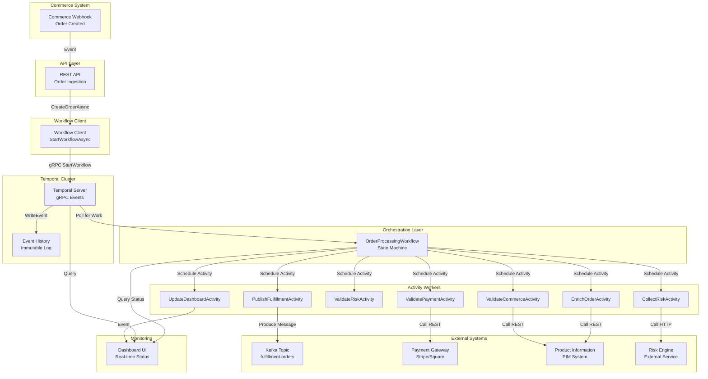
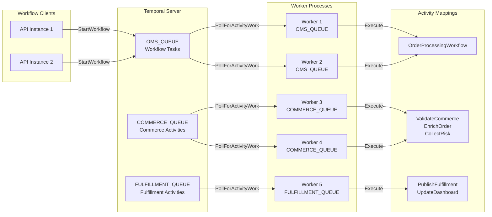
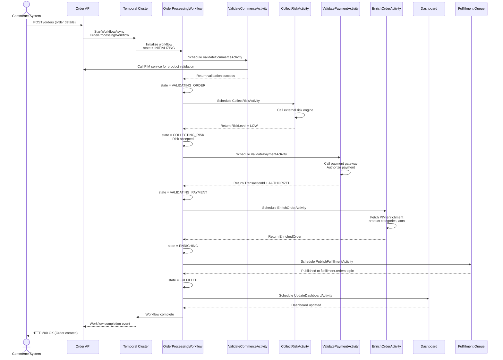
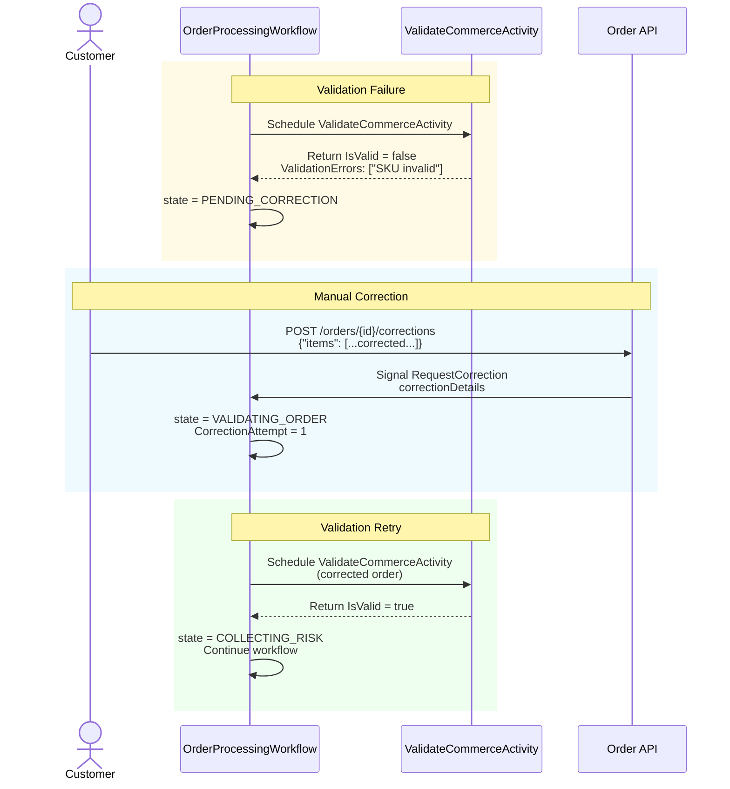
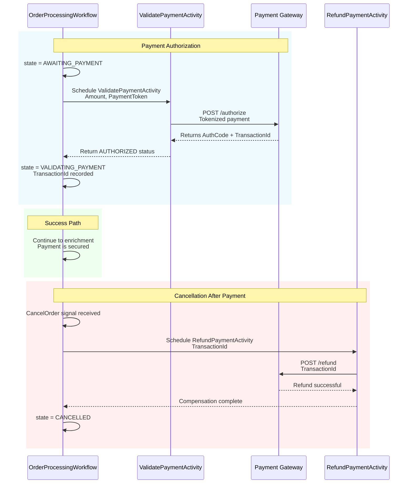
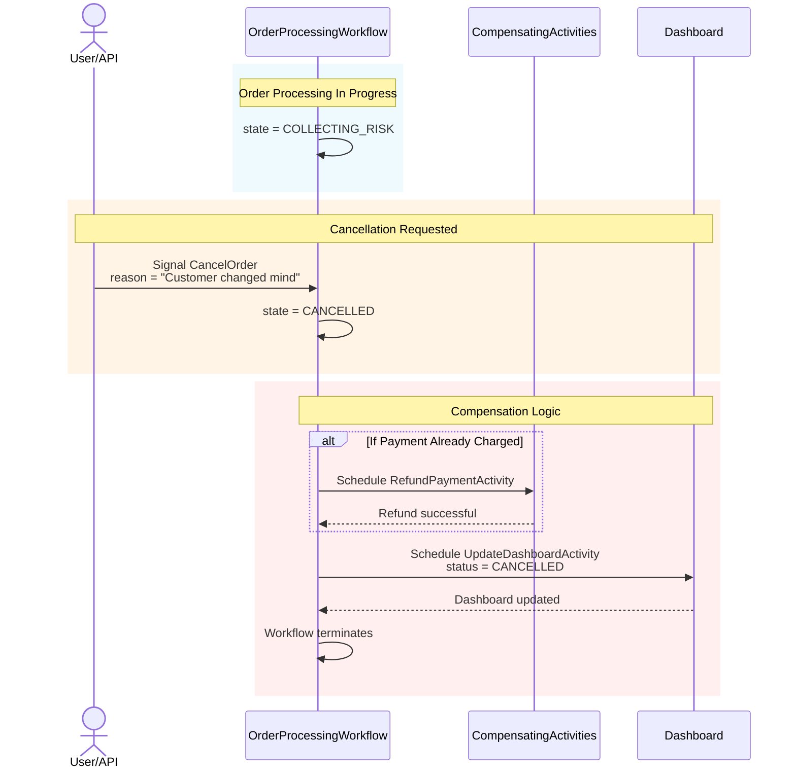
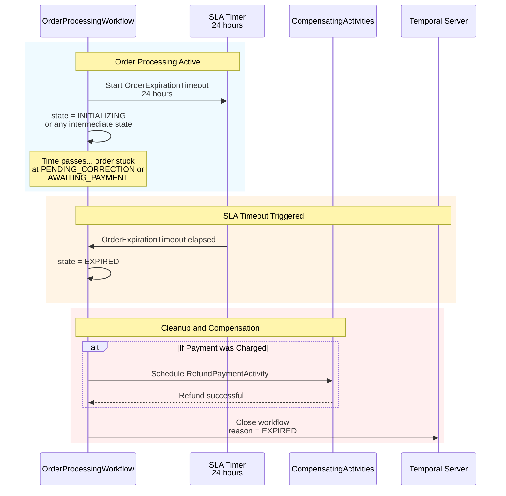
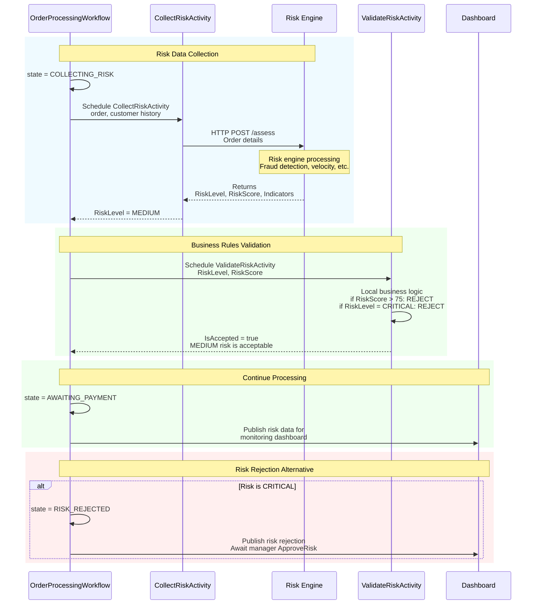

# Production-Grade Order Management System Architecture
## Using Temporal .NET SDK

---

## Executive Summary

### The Problem

Modern e-commerce order processing faces unprecedented challenges: orders flow across multiple systems (payment gateways, fulfillment networks, risk engines), each introducing latency and potential failure points. Traditional approaches using message queues and databases lead to:

- **Distributed transaction complexity**: Coordinating updates across payment, fulfillment, and risk systems becomes brittle
- **State management chaos**: Tracking order progress across multiple services with partial failures
- **Loss of visibility**: Debugging multi-step processes when individual components fail
- **Replay vulnerability**: Unable to safely replay workflows or understand historical execution paths

### Why Temporal

Temporal provides a purpose-built platform for distributed orchestration that eliminates these challenges:

- **Durable Execution Model**: Workflows survive infrastructure failures without external persistence logic
- **Transparent Replay**: Complete execution history enables replay safety and auditing
- **Built-in Compensation**: Native support for compensating transactions and cleanup on failure
- **Single Source of Truth**: Workflow definition is both the implementation and documentation
- **Time Travel Debugging**: Replay workflows to understand failure scenarios

### How This Architecture Satisfies Key Requirements

#### Reliability
- **Guaranteed Delivery**: All workflow steps complete exactly once, even across infrastructure failures
- **Automatic Retries**: Activities retry with exponential backoff; workflows survive worker crashes
- **Compensation**: Payment reversals and cancellations execute through compensating activities
- **Idempotent Operations**: All external system calls are idempotent; re-execution is safe

#### Scalability
- **Horizontal Workers**: Multiple independent worker processes scale activity execution
- **Task Queue Isolation**: Separate queues (OMS_QUEUE, COMMERCE_QUEUE, FULFILLMENT_QUEUE) prevent head-of-line blocking
- **Stateless Activities**: Activities are ephemeral; no session affinity required
- **Event Sourcing**: Workflow history is append-only; no lock contention

#### Replay Safety
- **Deterministic Workflows**: No external system calls from workflow code; all external operations are activities
- **Version-Aware Execution**: Workflow.GetVersion() enables safe workflow upgrades mid-flight
- **Complete Audit Trail**: Every workflow step is recorded; replay produces identical results
- **Test Infrastructure**: Dedicated replay tests verify forward compatibility

#### Maintainability
- **Clear Separation of Concerns**: Workflow orchestration, activities, domain logic, and infrastructure are isolated
- **Explicit Data Flow**: Signals and queries clearly define runtime communication
- **Structured Error Handling**: Errors flow through defined compensation paths
- **Domain-Driven Design**: Domain models represent true business state

#### Future Extensibility
- **Pluggable Activities**: New risk providers or fulfillment systems integrate without workflow changes
- **Signal-Based Extensions**: New business logic attaches via signals without core workflow modification
- **Child Workflow Support**: Complex sub-processes can be extracted to child workflows
- **Sagas Pattern**: Multi-stage operations with rollback are built into the architecture

---

## Solution Overview

The architecture implements a multi-layer orchestration model where Temporal coordinates across commerce systems, payment gateways, fulfillment networks, and internal services.



### Data Flow

1. **Commerce Event**: Order created event triggers webhook
2. **API Ingestion**: REST endpoint receives order details
3. **Workflow Start**: API calls Temporal to start `OrderProcessingWorkflow`
4. **Orchestration**: Workflow coordinates multi-step process through activities
5. **Activity Execution**: Workers execute idempotent operations against external systems
6. **Feedback Loop**: Dashboard queries workflow state and activity status
7. **Fulfillment**: Completed orders published to Kafka for warehouse systems

---

## Project Structure

### Oms.Api
**Responsibility**: HTTP ingestion layer and workflow client factory

- REST endpoints for order creation and updates
- Temporal WorkflowClient initialization and connection pooling
- Request validation and sanitization
- OpenTelemetry instrumentation for incoming requests
- Error handling and HTTP status code mapping

**Key Classes**: `OrderController`, `WorkflowClientFactory`, `OrderRequest`, `OrderResponse`

### Oms.Worker
**Responsibility**: Activity execution and task queue polling

- Worker host configuration with gRPC connection settings
- Activity registration and worker setup
- Multiple task queue workers (OMS_QUEUE, COMMERCE_QUEUE, FULFILLMENT_QUEUE)
- Worker auto-scaling triggers and metrics export
- Graceful shutdown and health checks

**Key Classes**: `TemporalWorkerHost`, `WorkerOptions`, `TaskQueueConfiguration`

### Oms.Domain
**Responsibility**: Core business entities and value objects

- `Order` aggregate root with order items and state
- `Customer` entity with contact information
- `Payment` aggregate with transaction history
- `RiskData` value object for risk assessment results
- `EnrichedOrder` domain event for downstream systems
- Enum types: `OrderStatus`, `PaymentStatus`, `RiskLevel`
- Business rule validation at entity level

**Key Classes**: `Order`, `OrderItem`, `Customer`, `Payment`, `RiskData`, `EnrichedOrder`

### Oms.Application
**Responsibility**: Use cases and workflow orchestration logic

- `OrderService` for business logic orchestration
- `WorkflowOrchestrator` for workflow signal/query operations
- Application-level DTOs (Data Transfer Objects)
- Compensation logic coordinators
- Business event handlers

**Key Classes**: `OrderService`, `WorkflowOrchestrator`, `OrderApplicationDto`

### Oms.Infrastructure
**Responsibility**: External system integration

- HTTP clients for payment, risk, and PIM systems
- Kafka producer for fulfillment events
- Temporal SDK configuration and serialization setup
- Database access patterns (if used)
- Circuit breaker and retry policy implementations

**Key Classes**: `PaymentGatewayClient`, `RiskEngineClient`, `PimClient`, `KafkaProducer`, `PayloadCodecConfiguration`

### Oms.Contracts
**Responsibility**: Serializable data contracts

- Activity input and output POCOs (Plain Old C# Objects)
- Workflow signal and query parameters
- External system request/response models
- Shared message contracts for Kafka
- Protobuf definitions for cross-service communication

**Key Classes**: Activity input/output records, Signal parameters, Query parameters

### Oms.Temporal
**Responsibility**: Temporal-specific implementations

- `OrderProcessingWorkflow` definition
- All activity implementations (7 total)
- Temporal client wrappers with retry policies
- Workflow query handlers
- Workflow signal handlers
- Custom search attribute mappers

**Key Classes**: `OrderProcessingWorkflow`, `ValidateCommerceActivity`, `CollectRiskActivity`, `ValidateRiskActivity`, `ValidatePaymentActivity`, `EnrichOrderActivity`, `UpdateDashboardActivity`, `PublishFulfillmentActivity`

### Oms.Shared
**Responsibility**: Cross-cutting concerns

- Logging abstractions (OpenTelemetry)
- Tracing context propagation
- Metrics definitions
- Common exception types
- Utility extensions and helpers
- Constants and configuration keys

**Key Classes**: `Logger`, `TracingContext`, `MetricsCollector`, `TemporalException`

### Oms.Tests
**Responsibility**: Unit and integration testing

- Workflow unit tests with TestWorkflowEnvironment
- Activity mock tests
- API endpoint tests with WebApplicationFactory
- Domain model tests
- Service layer tests

**Key Classes**: `OrderProcessingWorkflowTests`, `ActivityTests`, `ApiIntegrationTests`

### Oms.ReplayTests
**Responsibility**: Replay safety verification

- Capture real workflow histories from staging
- Replay against new workflow versions
- Verify determinism across versions
- Validate GetVersion() correctness
- Document breaking changes

**Key Classes**: `ReplayTestRunner`, `HistoryCaptureRecorder`

---

## Domain Model

The domain model represents the core business logic for order processing. All external system interactions are abstracted into activities.

```mermaid
classDiagram
    class Order {
        +Guid OrderId
        +string OrderNumber
        +DateTime CreatedAt
        +DateTime ExpiresAt
        +OrderStatus CurrentStatus
        +Customer OrderCustomer
        +List~OrderItem~ Items
        +Payment OrderPayment
        +RiskData RiskAssessment
        +EnrichedOrder EnrichedData
        +DateTime UpdatedAt
        +AddItem(OrderItem)
        +UpdateStatus(OrderStatus)
        +GetTotalAmount()
        +IsExpired()
    }
    
    class OrderItem {
        +Guid ItemId
        +string ProductCode
        +string ProductName
        +decimal UnitPrice
        +int Quantity
        +decimal TotalPrice
        +CalculateLineTotal()
    }
    
    class Customer {
        +Guid CustomerId
        +string Email
        +string Name
        +string Phone
        +Address ShippingAddress
        +Address BillingAddress
        +CustomerSegment Segment
        +int PreviousOrderCount
    }
    
    class Address {
        +string Street
        +string City
        +string State
        +string ZipCode
        +string Country
    }
    
    class Payment {
        +Guid PaymentId
        +decimal Amount
        +PaymentStatus Status
        +string Gateway
        +string TransactionId
        +DateTime ProcessedAt
        +List~PaymentTransaction~ Transactions
        +int RetryCount
    }
    
    class PaymentTransaction {
        +Guid TransactionId
        +decimal Amount
        +TransactionStatus Status
        +DateTime Timestamp
        +string GatewayReference
    }
    
    class RiskData {
        +Guid RiskId
        +RiskLevel Level
        +decimal RiskScore
        +List~RiskIndicator~ Indicators
        +DateTime EvaluatedAt
        +string RiskEngineVersion
        +bool RequiresManualReview
    }
    
    class RiskIndicator {
        +string IndicatorType
        +string RiskFactor
        +decimal Weight
        +bool IsFlagged
    }
    
    class EnrichedOrder {
        +Guid OrderId
        +List~EnrichedOrderItem~ EnrichedItems
        +DateTime EnrichedAt
        +string PimVersion
        +List~ProductAttribute~ ProductAttributes
        +decimal EnrichedTotalPrice
    }
    
    class EnrichedOrderItem {
        +Guid ItemId
        +string ProductId
        +string Category
        +string Manufacturer
        +List~string~ Tags
        +decimal EnrichedPrice
    }
    
    class OrderStatus {
        <<enumeration>>
        INITIALIZING
        VALIDATING_ORDER
        PENDING_CORRECTION
        COLLECTING_RISK
        RISK_REJECTED
        AWAITING_PAYMENT
        PAYMENT_INVALID
        VALIDATING_PAYMENT
        ENRICHING
        FULFILLED
        EXPIRED
        CANCELLED
        PROCESSING_ERROR
    }
    
    class PaymentStatus {
        <<enumeration>>
        PENDING
        PROCESSING
        AUTHORIZED
        CAPTURED
        FAILED
        REVERSED
        REFUNDED
    }
    
    class RiskLevel {
        <<enumeration>>
        LOW
        MEDIUM
        HIGH
        CRITICAL
    }
    
    Order ||--o| Customer
    Order ||--o{ OrderItem
    Order ||--o| Payment
    Order ||--o| RiskData
    Order ||--o| EnrichedOrder
    Payment ||--o{ PaymentTransaction
    RiskData ||--o{ RiskIndicator
    EnrichedOrder ||--o{ EnrichedOrderItem
```

### Key Domain Concepts

**Order Aggregate**: Root entity that coordinates all order-related data. Maintains invariants around order status transitions and financial calculations.

**Payment**: Separate aggregate tracking payment lifecycle. Supports multiple transactions (retries, partial payments, reversals).

**RiskData**: Value object capturing external risk assessment. Immutable once created; prevents business logic drift from risk decisions.

**EnrichedOrder**: Domain event payload representing order after external enrichment. Enables clean separation between core order and enriched product data.

**Customer**: Entity capturing buyer context. Current implementation is transactional; future versions may support profiles and historical data.

---

## Workflow Design

### OrderProcessingWorkflow: The Core Orchestrator

The `OrderProcessingWorkflow` is the single source of truth for order processing logic. It coordinates all business steps through signal handlers, activity calls, and internal state management.

```
Workflow Lifecycle:
  Start → Initialize → Listen for Signals → Handle Activities → Final State
  
Signals can arrive at any point:
  - CancelOrder() at any state → CANCELLED
  - RequestCorrection() in validation states → PENDING_CORRECTION
```

### Workflow States

The workflow progresses through strictly ordered states:

1. **INITIALIZING**: Validate input, initialize order aggregate
2. **VALIDATING_ORDER**: Execute `ValidateCommerceActivity` to verify order data
3. **PENDING_CORRECTION**: Pause for correction signal; wait for retry
4. **COLLECTING_RISK**: Execute `CollectRiskActivity` from external risk engine
5. **RISK_REJECTED**: State for rejected risk; decision to cancel or escalate
6. **AWAITING_PAYMENT**: Pause before payment processing
7. **VALIDATING_PAYMENT**: Execute `ValidatePaymentActivity` against payment gateway
8. **PAYMENT_INVALID**: State for failed payment; retry or cancel
9. **VALIDATING_PAYMENT_CONFIRMATION**: Execute payment validation post-capture
10. **ENRICHING**: Execute `EnrichOrderActivity` from PIM system
11. **FULFILLED**: Execute `PublishFulfillmentActivity` to Kafka
12. **COMPLETED**: Final state after dashboard update
13. **EXPIRED**: Canceled due to SLA timeout
14. **CANCELLED**: Canceled by signal or business logic
15. **PROCESSING_ERROR**: Unrecoverable error state

### Workflow Responsibilities

- **State Management**: Maintain `OrderStatus` and persist state to Event History
- **Activity Orchestration**: Schedule activities with proper inputs and error handling
- **Signal Handling**: Respond to `CancelOrder()`, `RequestCorrection()` signals
- **Query Support**: Answer `GetOrderStatus()`, `GetOrderDetails()`, `GetPaymentStatus()` queries
- **Compensation**: Chain compensating activities on failure (e.g., refund on payment failure)
- **Timeout Management**: Enforce SLA with `OrderExpirationTimeout` (default 24 hours)
- **Retry Coordination**: Retry failed activities with exponential backoff

### Signals

**CancelOrder()**
- Input: `CancellationReason` (string)
- Effect: Immediately transitions to CANCELLED state
- Compensation: Refund payment if already charged
- Available: Any state except CANCELLED or EXPIRED

**RequestCorrection()**
- Input: `CorrectionDetails` (order corrections)
- Effect: Resets to VALIDATING_ORDER state
- Constraint: Maximum 3 correction attempts
- Available: PENDING_CORRECTION or PAYMENT_INVALID states

**ApproveRisk()**
- Input: `ManualApprovalReason` (string)
- Effect: Overrides RISK_REJECTED, continues to AWAITING_PAYMENT
- Constraint: Requires manager approval (enforced at API layer)
- Available: RISK_REJECTED state only

### Queries

**GetOrderStatus()**
- Returns: Current `OrderStatus` enum
- Purpose: Dashboard real-time status updates
- Performance: O(1) in-memory lookup

**GetOrderDetails()**
- Returns: Complete `OrderDto` with all order data
- Purpose: Detailed order view in dashboard
- Performance: May reconstruct from Event History if workflow paused

**GetPaymentStatus()**
- Returns: `PaymentStatus` enum and transaction details
- Purpose: Payment-specific dashboard queries
- Performance: O(1) if payment already processed

### Why Only One Workflow

A single `OrderProcessingWorkflow` provides:

- **Clear Ownership**: Single point of responsibility for order lifecycle
- **Simplified Testing**: Easier to verify all paths in tests
- **Replay Safety**: One workflow definition is easier to version correctly
- **State Consistency**: No coordination between multiple workflows required
- **Monitoring**: Single workflow metrics give complete system view

Child workflows are avoided initially; future versions may extract risk collection or payment into child workflows for organizational clarity without complexity cost.

---

## Activity Design

Each activity represents a single external system call with defined timeouts, retries, and idempotency.

### ValidateCommerceActivity

**Purpose**: Verify order data from commerce system matches requirements

**Inputs**:
```
- OrderId: Guid
- CustomerId: Guid
- Items: List<OrderItemInput>
- TotalAmount: decimal
```

**Outputs**:
```
- IsValid: bool
- ValidationErrors: List<string>
- ValidatedOrder: OrderDto
```

**Timeout**: 10 seconds (remote API latency)
**Retry Strategy**: Exponential backoff (1s, 2s, 4s), max 3 attempts
**Heartbeat**: None (short-lived operation)
**Idempotency**: Keyed by OrderId; repeat calls return same result

### CollectRiskActivity

**Purpose**: Call external risk engine to assess order risk level

**Inputs**:
```
- OrderId: Guid
- CustomerId: Guid
- Order: OrderDto
- CustomerHistory: CustomerHistoryDto
```

**Outputs**:
```
- RiskLevel: enum (LOW, MEDIUM, HIGH, CRITICAL)
- RiskScore: decimal (0-100)
- RiskIndicators: List<string>
- RequiresManualReview: bool
```

**Timeout**: 30 seconds (risk engine SLA)
**Retry Strategy**: Exponential backoff (2s, 4s, 8s), max 5 attempts
**Heartbeat**: Every 10 seconds on long-running risk scoring
**Idempotency**: Keyed by OrderId; prevent duplicate risk evaluations

### ValidateRiskActivity

**Purpose**: Internal business logic to determine if risk level is acceptable

**Inputs**:
```
- OrderId: Guid
- RiskLevel: enum
- RiskScore: decimal
- CustomerId: Guid
```

**Outputs**:
```
- IsAccepted: bool
- RejectionReason: string (if rejected)
```

**Timeout**: 5 seconds (local business logic)
**Retry Strategy**: No retry (deterministic local logic)
**Heartbeat**: None
**Idempotency**: Keyed by OrderId; based on risk level alone

### ValidatePaymentActivity

**Purpose**: Authorize payment with payment gateway

**Inputs**:
```
- OrderId: Guid
- Amount: decimal
- Currency: string (USD)
- PaymentToken: string (tokenized payment)
- CustomerId: Guid
```

**Outputs**:
```
- TransactionId: string
- Status: enum (AUTHORIZED, FAILED, DECLINED)
- ErrorCode: string (if failed)
- AuthCode: string
```

**Timeout**: 20 seconds (payment gateway latency)
**Retry Strategy**: Exponential backoff (2s, 4s, 8s), max 5 attempts
**Heartbeat**: Every 5 seconds (payment is critical path)
**Idempotency**: Keyed by OrderId + Amount; payment gateway prevents double-charges

**Compensation**: On workflow cancellation, `RefundPaymentActivity` reverses the charge

### EnrichOrderActivity

**Purpose**: Fetch detailed product information from PIM system

**Inputs**:
```
- OrderId: Guid
- Items: List<OrderItemDto>
```

**Outputs**:
```
- EnrichedOrder: EnrichedOrderDto
- EnrichedItems: List<EnrichedOrderItemDto>
- PimVersion: string
```

**Timeout**: 15 seconds (PIM API latency)
**Retry Strategy**: Exponential backoff (1s, 2s, 4s), max 3 attempts
**Heartbeat**: None (short-lived)
**Idempotency**: Keyed by OrderId; PIM data is static for order items

### UpdateDashboardActivity

**Purpose**: Publish order status updates to dashboard system

**Inputs**:
```
- OrderId: Guid
- Status: OrderStatus
- Details: OrderDto
- Timestamp: DateTime
```

**Outputs**:
```
- Success: bool
- DashboardEventId: string
```

**Timeout**: 10 seconds (dashboard API latency)
**Retry Strategy**: Exponential backoff (1s, 2s, 4s), max 3 attempts
**Heartbeat**: None (fast operation)
**Idempotency**: Keyed by OrderId + Status; dashboard deduplicates status updates

### PublishFulfillmentActivity

**Purpose**: Publish completed order to Kafka for warehouse fulfillment

**Inputs**:
```
- OrderId: Guid
- EnrichedOrder: EnrichedOrderDto
- PaymentStatus: PaymentStatus
- ShippingAddress: AddressDto
```

**Outputs**:
```
- KafkaPartition: int
- KafkaOffset: long
- PublishedAt: DateTime
```

**Timeout**: 15 seconds (Kafka produce latency)
**Retry Strategy**: Exponential backoff (1s, 2s, 4s, 8s), max 5 attempts
**Heartbeat**: Every 5 seconds (long-duration Kafka batching)
**Idempotency**: Keyed by OrderId; Kafka topic configured for exactly-once semantics

---

## Worker Topology

### Task Queue Architecture

Multiple task queues prevent head-of-line blocking and enable independent scaling:



### Queue Purposes

**OMS_QUEUE** (Workflow Execution)
- Activities: None directly; used for workflow polling only
- Throughput: Low (1-2 workers sufficient; workflow execution is lightweight)
- Scaling: Fixed (workflows are long-lived; workers just coordinate)
- Purpose: Prevents workflow decisions from blocking other queues

**COMMERCE_QUEUE** (External System Integration)
- Activities: `ValidateCommerceActivity`, `CollectRiskActivity`, `EnrichOrderActivity`
- Throughput: High (remote API calls + network latency)
- Scaling: Auto-scale based on queue depth (4-16 workers)
- Purpose: All remote calls isolated; slow API responses don't block internal activities

**FULFILLMENT_QUEUE** (Async Publish)
- Activities: `PublishFulfillmentActivity`, `UpdateDashboardActivity`
- Throughput: Medium (async operations; network latency acceptable)
- Scaling: Auto-scale (2-8 workers)
- Purpose: Dashboard and Kafka publishes separated to allow independent retry policies

### Scaling Strategy

**Horizontal Scaling**:
- Add worker processes via container orchestration (Kubernetes)
- Workers automatically poll assigned task queue
- Temporal server load-balances across workers
- No state affinity; workers are stateless

**Auto-Scaling Triggers**:
- Queue depth > 100 tasks → spawn additional COMMERCE_QUEUE workers
- Queue depth > 50 tasks → spawn additional FULFILLMENT_QUEUE workers
- Activity timeout rate > 5% → investigate bottleneck (not scale immediately)

**Vertical Scaling**:
- Increase worker concurrency (default 100 concurrent activities per worker)
- Monitor CPU and memory per worker process
- Stop scaling vertically once memory > 1GB per worker

**Monitoring Metrics**:
- Activities/sec per queue
- Activity latency (p99)
- Activity timeout rate
- Queue depth (tasks pending)
- Worker CPU and memory utilization

---

## State Machine

The order processing workflow follows a strictly defined state machine with clear transitions and compensation paths.

```mermaid
stateDiagram-v2
    [*] --> INITIALIZING
    
    INITIALIZING --> VALIDATING_ORDER: ValidateCommerceActivity
    VALIDATING_ORDER --> PENDING_CORRECTION: Validation fails
    VALIDATING_ORDER --> COLLECTING_RISK: Validation succeeds
    PENDING_CORRECTION --> VALIDATING_ORDER: RequestCorrection signal
    PENDING_CORRECTION --> CANCELLED: CancelOrder signal
    PENDING_CORRECTION --> EXPIRED: SLA timeout
    
    COLLECTING_RISK --> RISK_REJECTED: Risk level CRITICAL
    COLLECTING_RISK --> AWAITING_PAYMENT: Risk accepted
    RISK_REJECTED --> CANCELLED: CancelOrder signal
    RISK_REJECTED --> AWAITING_PAYMENT: ApproveRisk signal (manager override)
    RISK_REJECTED --> EXPIRED: SLA timeout
    
    AWAITING_PAYMENT --> VALIDATING_PAYMENT: Proceed with payment
    AWAITING_PAYMENT --> CANCELLED: CancelOrder signal
    AWAITING_PAYMENT --> EXPIRED: SLA timeout
    
    VALIDATING_PAYMENT --> PAYMENT_INVALID: Payment fails
    VALIDATING_PAYMENT --> ENRICHING: Payment succeeds
    PAYMENT_INVALID --> CANCELLED: CancelOrder signal
    PAYMENT_INVALID --> PENDING_CORRECTION: RequestCorrection signal
    PAYMENT_INVALID --> EXPIRED: SLA timeout
    
    ENRICHING --> FULFILLED: Enrichment succeeds
    ENRICHING --> CANCELLED: CancelOrder signal
    ENRICHING --> PROCESSING_ERROR: Enrichment fails
    
    FULFILLED --> [*]
    CANCELLED --> [*]
    EXPIRED --> [*]
    PROCESSING_ERROR --> [*]
    
    note right of INITIALIZING
        Load order data
        Create Order aggregate
    end
    
    note right of VALIDATING_ORDER
        ValidateCommerceActivity
        Verify items exist
        Check pricing
    end
    
    note right of PENDING_CORRECTION
        Wait for RequestCorrection signal
        Retry validation
        Max 3 attempts
    end
    
    note right of COLLECTING_RISK
        CollectRiskActivity
        External risk engine
        ValidateRiskActivity
    end
    
    note right of RISK_REJECTED
        RiskLevel = CRITICAL
        Requires ApproveRisk signal
        or CancelOrder signal
    end
    
    note right of AWAITING_PAYMENT
        Manual pause point
        Can still CancelOrder
        Updates dashboard
    end
    
    note right of VALIDATING_PAYMENT
        ValidatePaymentActivity
        Payment authorization
        Tokenized payment
    end
    
    note right of PAYMENT_INVALID
        Payment failed
        Retry available via
        RequestCorrection
    end
    
    note right of ENRICHING
        EnrichOrderActivity
        Fetch PIM data
        Prepare for fulfillment
    end
    
    note right of FULFILLED
        PublishFulfillmentActivity
        Publish to Kafka
        UpdateDashboardActivity
        Order complete
    end
    
    note right of CANCELLED
        RefundPaymentActivity
        (if payment charged)
        Compensating transaction
    end
    
    note right of EXPIRED
        SLA timeout (24h)
        Auto-cancellation
        Triggers refund
    end
    
    note right of PROCESSING_ERROR
        Unrecoverable error
        Manual intervention
        required
    end
```

### State Transitions Explained

**INITIALIZING → VALIDATING_ORDER**
- Automatic transition after order data validation
- Order aggregate created and stored in workflow state
- No user action required

**VALIDATING_ORDER → PENDING_CORRECTION**
- ValidateCommerceActivity returns validation errors
- User can submit corrected order via RequestCorrection signal
- Maximum 3 correction attempts allowed

**VALIDATING_ORDER → COLLECTING_RISK**
- ValidateCommerceActivity succeeds
- Order is valid; proceed to risk collection
- No manual intervention required

**COLLECTING_RISK → RISK_REJECTED**
- External risk engine returns RiskLevel = CRITICAL
- Business rules reject the order
- Can only proceed with manager ApproveRisk signal

**RISK_REJECTED → AWAITING_PAYMENT**
- ApproveRisk signal received with manager authorization
- Risk override recorded in Event History
- Proceeds to payment processing

**AWAITING_PAYMENT → VALIDATING_PAYMENT**
- Explicit transition (via query response or automatic after pause)
- No further delays; proceed with payment authorization
- Must have valid payment token

**VALIDATING_PAYMENT → PAYMENT_INVALID**
- ValidatePaymentActivity returns FAILED or DECLINED
- Workflow pauses; awaits retry or cancellation
- Retry via RequestCorrection resets to VALIDATING_PAYMENT

**VALIDATING_PAYMENT → ENRICHING**
- Payment authorization successful
- TransactionId recorded; refund can now be performed if needed
- Proceed to product enrichment

**ENRICHING → FULFILLED**
- EnrichOrderActivity returns enriched order data
- PublishFulfillmentActivity publishes to Kafka successfully
- UpdateDashboardActivity confirms order complete
- No further action possible

**Any State → CANCELLED**
- CancelOrder signal received
- If payment was charged, RefundPaymentActivity compensates
- Workflow terminates immediately
- Dashboard notified via UpdateDashboardActivity

**Any State → EXPIRED**
- OrderExpirationTimeout (24 hours) exceeded
- Automatic workflow termination
- If payment charged, refund triggered
- SLA violation recorded in metrics

---

## Sequence Diagrams

### Happy Path: Order Creation → Fulfillment



### Correction Flow: Validation Failure → Manual Correction



### Payment Flow: Authorization → Confirmation



### Cancellation: Cancel at Any Stage



### Expiration: SLA Timeout Handling



### Risk Collection: Detailed Risk Assessment



---

## Failure Strategy

### Activity Retry Strategy

**Exponential Backoff with Jitter**

Each activity has defined retry policies to recover from transient failures:

```
Retry Interval: 1 second
Backoff Coefficient: 2
Max Retries: Activity-specific (3-5)
Jitter: ±10% to prevent thundering herd

Example (3 max retries):
  Attempt 1 fails at T=0s
  Wait 1s ± 0.1s
  Attempt 2 fails at T≈1s
  Wait 2s ± 0.2s
  Attempt 3 fails at T≈3s
  Wait 4s ± 0.4s
  Attempt 4 fails at T≈7s
  Total time: ~7 seconds before workflow failure
```

**Per-Activity Configuration**

- `ValidateCommerceActivity`: Max 3 retries (remote PIM call; assume data is static)
- `CollectRiskActivity`: Max 5 retries (critical path; risk engine may be temporarily slow)
- `ValidatePaymentActivity`: Max 5 retries (critical path; payment gateway issues are common)
- `EnrichOrderActivity`: Max 3 retries (non-critical; fallback to base order if fails)
- `UpdateDashboardActivity`: Max 3 retries (non-critical; failure doesn't affect order)
- `PublishFulfillmentActivity`: Max 5 retries (critical; Kafka publish must succeed)

### Workflow Retry Strategy

Workflows themselves are retried on failure:

- **Workflow Timeout**: Not used (workflows run indefinitely until completion or cancellation)
- **Workflow Retry**: If workflow fails due to unhandled exception, retry with default policy
  - Max Attempts: 2 (don't overwhelm system)
  - Initial Interval: 60 seconds
  - Backoff Coefficient: 2

**When Workflow Fails**:
1. Last state recorded in Event History
2. Workflow re-instantiated at last recorded state
3. Workflow resumes from last signal/activity boundary
4. No state is lost; replay guarantees determinism

### Business Failure Handling

**Validation Failure (ValidateCommerceActivity)**
- Workflow transitions to `PENDING_CORRECTION`
- Order is paused; user must submit corrections
- If not corrected within 24 hours, order expires
- Dashboard shows "Awaiting Customer Correction" status

**Risk Rejection (RiskLevel = CRITICAL)**
- Workflow transitions to `RISK_REJECTED`
- Requires explicit manager approval via `ApproveRisk` signal
- If not approved within 24 hours, order expires
- Dashboard alerts risk team of high-risk orders

**Payment Failure (ValidatePaymentActivity returns FAILED)**
- Workflow transitions to `PAYMENT_INVALID`
- User can request correction or retry
- If customer has updated payment method, retry via RequestCorrection
- Failed payments don't trigger refund (no charge occurred)

### Infrastructure Failure Handling

**Temporal Server Unavailable**
- API calls to `StartWorkflowAsync` fail immediately
- Error returned to caller; customer sees "System Error" UI
- Retry at application layer (standard HTTP retry policy)
- No partial state created in Event History

**Activity Worker Crash**
- In-flight activity marked as timed out (if no heartbeat within TTL)
- Temporal server reschedules activity on available worker
- Activity re-executes from start (idempotency required)
- No data loss; Event History preserved

**Database or Cache Failure (for order state)**
- If using cache, cache miss is transparent
- Workflow state reconstructed from Event History on demand
- No external database required for workflow state (only Event History)

### Dashboard Failure (UpdateDashboardActivity)

**Dashboard Service Down**
- `UpdateDashboardActivity` fails after retries
- Workflow continues (dashboard is informational only)
- Event History records dashboard failure
- Order processing not blocked

**Retry Policy**:
- Max 3 retries (dashboard is non-critical)
- If all retries fail, workflow logs failure but continues
- Manual dashboard reconciliation triggered via backfill job

### Kafka Failure (PublishFulfillmentActivity)

**Kafka Cluster Offline**
- `PublishFulfillmentActivity` fails to connect
- Max 5 retries with exponential backoff
- If Kafka unavailable for >30 seconds, activity timeout occurs
- Workflow halted in ENRICHING state

**Recovery**:
1. Kafka cluster brought online
2. Activity automatically retried by Temporal
3. Order continues to FULFILLED state
4. Fulfillment message delivered with delay

**Exactly-Once Semantics**:
- Kafka topic configured with idempotent producer
- `PublishFulfillmentActivity` idempotent key = OrderId
- If duplicate publish occurs, Kafka deduplicates
- Warehouse system receives order exactly once

### Payment Failure Handling

**Payment Authorization Failure**
- Gateway returns DECLINED or FAILED
- Workflow transitions to `PAYMENT_INVALID`
- User prompted to retry with different payment method
- NO partial charge occurs (authorization only)

**Payment Refund Failure** (during workflow cancellation)
- If refund attempt fails, it is retried
- Max 5 retries (payment is critical)
- If refund fails after all retries, escalate to manual review
- Event History records refund failure with transaction details
- Finance team reviews via dashboard

### Compensation Strategy

**Automatic Compensation**
- When workflow cancels after payment is authorized, `RefundPaymentActivity` is scheduled
- Refund is treated like any other activity (retried, timed out, heartbeat monitored)
- On successful refund, TransactionId is recorded in Event History
- Customer sees CANCELLED order status; funds returned within 3-5 business days

**Manual Compensation**
- If automatic refund fails and all retries exhausted, manual review required
- Dashboard shows "Pending Refund Review" for finance team
- Finance team can trigger manual refund via API
- Workflow state remains CANCELLED but refund is marked as pending

---

## Versioning Strategy

### Workflow.GetVersion() Pattern

The `Workflow.GetVersion()` method enables safe workflow upgrades without losing in-flight orders.

**Purpose**: Add or modify workflow logic without breaking executing workflows

**Concept**:
- Each workflow version decision is assigned a unique ID
- Decision recorded immutably in Event History
- On replay, old versions execute old logic; new versions execute new logic
- Forward compatibility guaranteed

**Example: Adding Risk Collection**

Assume the original workflow skipped risk collection. Version 2 adds risk collection:

```csharp
// Version 1 (original workflow)
await workflow.ValidateCommerceActivity(...);
// Directly to payment (no risk step)
await workflow.ValidatePaymentActivity(...);

// Version 2 (new workflow with risk collection)
const int RiskCollectionVersion = 1;
int version = await workflow.GetVersion(
    "risk-collection", 
    Workflow.DefaultVersion,  // ← 0 = old path
    RiskCollectionVersion      // ← 1 = new path
);

await workflow.ValidateCommerceActivity(...);

if (version >= RiskCollectionVersion) {
    // NEW CODE: Risk collection added in Version 2
    var riskData = await workflow.CollectRiskActivity(...);
    await workflow.ValidateRiskActivity(riskData);
}

// Both versions converge here
await workflow.ValidatePaymentActivity(...);
```

**On Deployment**:
1. Deploy new workflow code
2. Workflows at Temporal cluster version 1 continue executing version 1 logic
3. New workflows start at version 2 logic
4. When version 1 workflow replays, it still executes version 1 logic (risk collection skipped)
5. Once version 1 workflow completes, version 2 workflows take over

### Replay Safety Principles

**Determinism**: Workflow code must always make the same decisions given same inputs

- ✅ OK: `await activity.GetOrderDetails(orderId)` - same input = same output
- ❌ BAD: `await activity.GetCurrentDateTime()` - non-deterministic
- ❌ BAD: `new Random().Next()` - non-deterministic
- ❌ BAD: `if (/* HTTP call result */)` - external state in workflow

**Immutable History**: Event History is append-only; cannot be modified

- When workflow replays, Event History is identical
- Workflow must replay to same conclusion
- GetVersion() enables opt-in to new logic; old versions always available

**Activity Result Caching**: Activity results are cached; re-execution produces same result

- If activity fails and is retried, it produces same result
- Activity must be idempotent: `f(x) = f(f(x))`

### Future: Risk Collection Release

**Scenario**: Risk collection is initially optional; future release makes it mandatory

**Current State** (Version 1):
- Risk collection is gated by feature flag or optional signal
- Some orders skip risk collection; proceed directly to payment
- Low-risk merchants benefit from faster processing

**Future Release** (Version 2):
- All orders must have risk assessment
- Risk collection is mandatory step
- Breaking change for workflows that skip risk

**Safe Migration**:

```csharp
const int MandatoryRiskCollection = 2;
int version = await workflow.GetVersion(
    "risk-collection-mandatory",
    RiskCollectionVersion,      // ← 1
    MandatoryRiskCollection     // ← 2
);

if (version >= MandatoryRiskCollection) {
    // NEW: Risk collection always required
    var riskData = await workflow.CollectRiskActivity(...);
    var accepted = await workflow.ValidateRiskActivity(riskData);
    if (!accepted && version >= MandatoryRiskCollection) {
        // Fail the order; risk is now required
        throw new RiskRejectedException();
    }
} else {
    // OLD: Risk collection optional
    if (/* feature flag */) {
        var riskData = await workflow.CollectRiskActivity(...);
        // Continue regardless of result
    }
}
```

### Rollout Strategy

**Phase 1: Deploy New Code**
- Deploy new workflow code to Temporal cluster
- Existing workflows continue on old version
- New workflows start on new version

**Phase 2: Monitor**
- Run new version for 24-48 hours
- Monitor activity success rates
- Verify no unexpected failures

**Phase 3: Gradual Adoption**
- If using Temporal Worker Versioning (future enhancement), gradually shift weight to new version
- Otherwise, all new workflows immediately use new version

**Phase 4: Old Workflows Complete**
- Wait for all old workflows to complete naturally
- Some orders may take hours/days; wait patiently
- No forced termination of old workflows

**Phase 5: Cleanup**
- Once all old workflows complete, remove GetVersion() branches
- GetVersion() guards are temporary (usually ~2 weeks)
- After cleanup, version guard code is deleted

### Replay Tests

**Purpose**: Verify new workflow versions replay old workflows correctly

**Process**:
1. Capture Event History from production workflow in staging
2. Load captured Event History into test environment
3. Run new workflow code against captured history
4. Verify replay produces identical results
5. Verify no new activities are scheduled against old history

**Example Test**:
```
Test: Replay v1 order with v2 workflow code
  Given: Event History from v1 workflow (no risk collection)
  When: Replay with v2 workflow code
  Then: 
    - Risk collection skipped (version guard returns 1)
    - Payment proceeds normally
    - Final state = FULFILLED
    - No new activities scheduled
```

---

## Payload Security

### Payload Codec: Encryption at Rest

Payloads in Event History contain sensitive order data (customer PII, payment info). Temporal Payload Codec encrypts payloads before storing in Event History.

**Architecture**:

```
Workflow → Serialize → Encrypt → Temporal Server → Event History (Encrypted)
Event History (Encrypted) → Decrypt → Deserialize → Workflow
```

**Encryption Algorithm: AES-256-GCM**

- **Mode**: Galois/Counter Mode (GCM) - authenticated encryption
- **Key Size**: 256 bits (32 bytes)
- **IV Size**: 96 bits (12 bytes) - randomly generated per payload
- **Authentication Tag**: 128 bits (16 bytes) - verifies payload integrity

**Why AES-256-GCM**:
- Industry standard for authenticated encryption
- Detects tampering; decryption fails if payload modified
- GCM provides confidentiality + authenticity in single operation
- No additional HMAC required

**Key Management**:
- Master key stored in secure vault (AWS Secrets Manager, Azure Key Vault)
- API and Worker instances retrieve key at startup
- Key rotation supported via versioned key management
- Compromised key: rotate and re-encrypt Event History

**Implementation**:

```csharp
// At Workflow Client Startup
var codec = new AesGcmPayloadCodec(masterKey);
var options = new TemporalClientOptions
{
    PayloadCodec = codec
};
var client = new TemporalClient(options);

// Workflow execution:
// 1. Activity returns OrderDto
// 2. Codec encrypts OrderDto before storing in Event History
// 3. Encrypted payload stored in Temporal Server
// 4. On workflow replay, codec decrypts payload
// 5. Workflow receives original OrderDto
```

**Payload Encryption Coverage**:
- ✅ Activity inputs (order details)
- ✅ Activity outputs (payment transaction ID)
- ✅ Workflow signal data (correction details)
- ✅ Workflow query results (order status)
- ❌ Workflow metadata (not encrypted; e.g., workflow ID, status)

### AES-GCM Implementation Details

**IV Generation**:
- Unique 96-bit IV generated per payload
- IV prepended to ciphertext (no separate IV storage needed)
- Random IV prevents rainbow table attacks

**Authentication Tag**:
- GCM generates 128-bit authentication tag
- Tag appended to ciphertext
- Decryption fails if ciphertext or key corrupted
- Prevents modification of encrypted data

**Data Format**:
```
[IV (12 bytes)] [Ciphertext (variable)] [Auth Tag (16 bytes)]
```

**Performance**:
- AES-GCM is hardware-accelerated on modern CPUs
- ~1-2 microseconds per KB on typical hardware
- Payload encryption overhead is negligible (<1% of activity latency)

### Future: PII Support

**Current State**: Order data (amounts, items) is encrypted but not specifically tagged as PII

**Future Requirement**: GDPR/CCPA compliance may require:
- PII data identification and flagging
- Separate encryption keys for PII
- Right to deletion of PII (challenges immutable Event History)
- PII redaction in dashboards

**Planned Approach**:
- Mark PII fields with custom attribute: `[PiiData]`
- Codec uses separate PII key for fields marked as PII
- Dashboard queries redact PII fields for non-authorized users
- GDPR deletion: logical deletion (PII key marked as deleted, payloads become unrecoverable)

---

## Search Attributes

Search Attributes enable querying workflows based on custom data without scanning all Event History.

```csharp
// Example Search Attribute Query
var workflows = await client.ListWorkflowsAsync(
    "OrderStatus = 'FULFILLED' AND CustomerId = 'abc123' AND WorkflowVersion >= 2"
);
```

### OrderStatus (Keyword)

**Type**: Keyword (exact match required)
**Values**: String representation of OrderStatus enum
  - "INITIALIZING", "VALIDATING_ORDER", "PENDING_CORRECTION", "COLLECTING_RISK", etc.
**Purpose**: Dashboard filtering by order state
**Why It Exists**: 
  - Dashboard needs to show "all orders in RISK_REJECTED state"
  - Without Search Attributes, must scan all Event Histories (expensive)
  - Search Attributes provide O(1) lookup

**Update Strategy**:
```csharp
// In OrderProcessingWorkflow
await workflow.UpsertSearchAttributesAsync(new Dictionary<string, object>
{
    ["OrderStatus"] = currentStatus.ToString()
});
```

### OrderId (Keyword)

**Type**: Keyword (exact match)
**Values**: UUID string representation
**Purpose**: Direct workflow lookup by order ID
**Why It Exists**:
  - Users search "show me order abc123"
  - Workflow ID is known but isolated in Temporal
  - Search Attribute enables "get me the workflow for this order"
  - Decouples public Order ID from internal Workflow ID

**Example Usage**:
```csharp
var workflow = (await client.ListWorkflowsAsync(
    "OrderId = 'order-2025-001234'"
)).FirstOrDefault();
```

### CustomerId (Keyword)

**Type**: Keyword (exact match)
**Values**: Customer UUID
**Purpose**: Dashboard queries (e.g., "show all orders for customer X")
**Why It Exists**:
  - Dashboard needs "order history for this customer"
  - Quickly find all workflows for given customer
  - Enables fraud detection (multiple failed orders from same customer)
  - Enables customer support (see all orders)

**Example Usage**:
```csharp
var customerOrders = await client.ListWorkflowsAsync(
    "CustomerId = 'cust-98765' AND OrderStatus = 'FULFILLED'"
);
```

### WorkflowVersion (Integer)

**Type**: Integer
**Values**: Version ID from Workflow.GetVersion()
**Purpose**: Monitor workflow version distribution
**Why It Exists**:
  - Operations needs "how many v1 workflows still running?"
  - Helps rollout team decide when to remove old code
  - Alerts if upgrade stuck (too many old versions after deadline)
  - Enables gradual version deprecation

**Example Usage**:
```csharp
var v1Workflows = await client.ListWorkflowsAsync(
    "WorkflowVersion = 1 AND ExecutionStatus = 'RUNNING'"
);
int countV1 = v1Workflows.Count; // Decide: remove v1 code?
```

### Search Attribute Schema

```sql
-- Temporal Search Attributes
OrderStatus         STRING      -- Current order state
OrderId             STRING      -- Public order ID
CustomerId          STRING      -- Customer UUID
WorkflowVersion     INT         -- Workflow version from GetVersion()
```

### Query Examples

**Dashboard: Orders Pending Correction**
```
OrderStatus = 'PENDING_CORRECTION'
```

**Support: Find Customer's Current Orders**
```
CustomerId = 'cust-12345' AND OrderStatus IN ('INITIALIZING', 'COLLECTING_RISK', 'AWAITING_PAYMENT', 'VALIDATING_PAYMENT', 'ENRICHING')
```

**Ops: Monitor Version Migration**
```
WorkflowVersion = 2 AND OrderStatus = 'FULFILLED'
```

**Metrics: Count Orders by Status**
```
OrderStatus = 'FULFILLED' StartTime >= now - 24h
```

---

## Observability

### Logging

**Philosophy**: Logs should tell the complete story of an order journey without requiring dashboard queries

**Log Levels**:

| Level | Use Case | Example |
|-------|----------|---------|
| DEBUG | Activity entry/exit | "Activity ValidateCommerceActivity started" |
| INFO | State transitions | "Order transitioned to COLLECTING_RISK" |
| WARN | Retries/non-fatal issues | "Activity retry 2/3 for ValidatePaymentActivity" |
| ERROR | Exceptions | "Activity failed after max retries" |

**Log Structure** (structured logging with OpenTelemetry):

```json
{
  "timestamp": "2025-07-03T10:15:30Z",
  "level": "INFO",
  "logger": "Oms.Temporal.OrderProcessingWorkflow",
  "message": "Order status updated",
  "attributes": {
    "workflow.id": "Order-abc123@1",
    "workflow.type": "OrderProcessingWorkflow",
    "trace.id": "abc123def456",
    "span.id": "xyz789",
    "order.id": "order-2025-001234",
    "customer.id": "cust-98765",
    "order.status": "COLLECTING_RISK",
    "activity.name": "CollectRiskActivity",
    "activity.attempt": 1
  }
}
```

**Logging Integration**:
- All logs sent to ELK Stack (Elasticsearch, Logstash, Kibana) or CloudWatch
- Structured format enables easy querying
- Trace ID propagates across all logs for single order journey
- Correlates logs across API, Workflow, and Activities

### Tracing

**OpenTelemetry Integration**: All Temporal operations emit traces

**Trace Hierarchy**:

```
Trace: Order API Request
├─ Span: StartWorkflow (Workflow Client)
│  └─ Span: Workflow Execution (Temporal Server)
│     ├─ Span: ValidateCommerceActivity
│     │  └─ Span: HTTP GET to PIM
│     ├─ Span: CollectRiskActivity
│     │  └─ Span: HTTP POST to Risk Engine
│     ├─ Span: ValidatePaymentActivity
│     │  └─ Span: HTTP POST to Payment Gateway
│     ├─ Span: EnrichOrderActivity
│     │  └─ Span: HTTP GET to PIM
│     └─ Span: PublishFulfillmentActivity
│        └─ Span: Kafka Produce
```

**Attributes per Span**:
- `workflow.id`: Unique workflow instance
- `workflow.type`: "OrderProcessingWorkflow"
- `activity.name`: Activity being executed
- `activity.attempt`: Current retry attempt
- `activity.duration_ms`: Activity execution time
- `http.method`, `http.url`: External HTTP calls
- `error.type`: Exception type if failed
- `kafka.partition`, `kafka.offset`: Kafka publish details

**Trace Backend**: 
- Jaeger (open-source) for development
- DataDog or Honeycomb for production
- 1-5 second retention for debugging recent issues
- Traces exported via gRPC OTLP protocol

### Metrics

**Key Metrics Collected**:

| Metric | Type | Purpose |
|--------|------|---------|
| `workflow.duration_ms` | Histogram | End-to-end order processing time |
| `activity.duration_ms` | Histogram | Individual activity latency |
| `activity.failure_rate` | Counter | Percentage of activities failing |
| `activity.retry_count` | Counter | Total retries across all activities |
| `workflow.state_transitions` | Counter | Track state machine traversals |
| `order.total_amount_usd` | Gauge | Order financial metrics |
| `dashboard.update_latency_ms` | Histogram | Dashboard notification delay |
| `fulfillment.publish_latency_ms` | Histogram | Kafka publish latency |

**Alerts Configured**:
- Activity success rate < 95%: alert ops team
- Workflow duration > 1 hour: escalate to debugging
- Payment failure rate > 5%: alert payment team
- Fulfillment publish failures > 10: alert warehouse team

### Dashboard Query Interface

**Query Types**:

1. **Workflow Queries** (from Query handlers):
   - `GetOrderStatus()` - returns current state
   - `GetOrderDetails()` - returns full order DTO
   - `GetPaymentStatus()` - returns payment-specific details

2. **Search Attribute Queries** (from ListWorkflows):
   - `OrderStatus = 'FULFILLED'`
   - `CustomerId = 'cust-xyz'`
   - `WorkflowVersion = 2`

3. **Historical Queries** (from Event History):
   - Full state reconstruction at any point in time
   - Audit trail of all state changes
   - Complete payment transaction history

### OpenTelemetry Integration

**OTEL SDK Setup**:

```csharp
var otel = new OpenTelemetryBuilder()
    .WithTracing(builder =>
    {
        builder
            .AddTemporalInstrumentation()
            .AddHttpClientInstrumentation()
            .AddKafkaInstrumentation()
            .AddOtlpExporter(options =>
            {
                options.Endpoint = new Uri("http://otel-collector:4317");
                options.Protocol = OtlpExportProtocol.Grpc;
            });
    })
    .WithMetrics(builder =>
    {
        builder
            .AddMeter("Oms.Metrics")
            .AddOtlpExporter(options =>
            {
                options.Endpoint = new Uri("http://otel-collector:4317");
                options.Protocol = OtlpExportProtocol.Grpc;
            });
    })
    .Build();
```

**Components**:
- **Tracing**: Captures request flow across services
- **Metrics**: Aggregates performance statistics
- **Logs**: Exports structured logs with trace correlation
- **Exporter**: Sends to OTel collector via gRPC

**Standard Attributes Included**:
- `service.name`: "order-management-system"
- `service.version`: "2.1.0"
- `deployment.environment`: "production"
- `telemetry.sdk.name`: "opentelemetry"
- `telemetry.sdk.language`: "dotnet"

---

## Testing Strategy

### Workflow Tests

**Purpose**: Verify workflow logic in controlled environment

**Environment**: `TestWorkflowEnvironment` (Temporal test framework)
- No Temporal server required
- Time is skipped (tests run in milliseconds, not hours)
- Deterministic behavior
- Activity mocking supported

**Test Types**:

1. **Happy Path Test**:
   - Mock successful activity results
   - Verify workflow progresses INITIALIZING → FULFILLED
   - Assert final state is correct
   - Verify all activities called in order

2. **Failure and Retry Test**:
   - Mock first activity call fails
   - Mock second attempt succeeds
   - Verify workflow retries automatically
   - Verify final state is correct

3. **Signal Handling Test**:
   - Start workflow
   - Send CancelOrder signal mid-execution
   - Verify workflow transitions to CANCELLED
   - Verify compensation activities scheduled

4. **Query Handling Test**:
   - Start workflow
   - Pause workflow at specific state
   - Query GetOrderStatus()
   - Verify returned status matches current state

### Replay Tests

**Purpose**: Verify new workflow versions are compatible with old executions

**Setup**:
1. Capture Event History from staging workflow
2. Store as JSON file in test project
3. Replay captured history against new workflow code
4. Assert replay produces identical results

**Test Structure**:
```
ReplayTests/
  ├─ v1-to-v2-happy-path.json
  ├─ v1-to-v2-payment-failure.json
  ├─ v1-to-v2-cancellation.json
  └─ ReplayTestRunner.cs
```

**Verification**:
- ✅ Workflow reaches same final state
- ✅ Same activities called in same order
- ✅ Same outputs from activities
- ✅ No new activities scheduled

### Time Skipping

**Temporal Test Feature**: Automatically fast-forward time in tests

**Example Use Case**: Test SLA timeout

```csharp
// Without time skipping (would wait 24 hours):
// await Task.Delay(TimeSpan.FromHours(24));

// With time skipping:
[Test]
public async Task OrderExpires_After_24_Hours()
{
    // Workflow starts
    var workflow = testEnv.StartWorkflow();
    
    // Manual state: order is in PENDING_CORRECTION
    workflow.GetCurrentStatus(); // PENDING_CORRECTION
    
    // Fast-forward 24 hours
    testEnv.SkipTime(TimeSpan.FromHours(24));
    
    // Workflow auto-expires
    await workflow.CompletionAsync();
    
    // Verify expired state
    Assert.AreEqual(OrderStatus.EXPIRED, workflow.GetFinalStatus());
}
```

### Signal Tests

**Purpose**: Verify signal handlers work correctly

**Test**: Send CancelOrder signal and verify compensation

```csharp
[Test]
public async Task CancelOrder_Triggers_Refund()
{
    var workflow = testEnv.StartWorkflow();
    
    // Let workflow progress to payment
    testEnv.ExecuteActivity(ValidateCommerceActivity, ...);
    testEnv.ExecuteActivity(ValidatePaymentActivity, ...);
    
    // Send cancel signal
    await workflow.SendSignalAsync(w => w.CancelOrder("Customer requested"));
    
    // Workflow should schedule refund
    var refundActivity = testEnv.GetScheduledActivity("RefundPaymentActivity");
    Assert.NotNull(refundActivity);
    
    // Complete workflow
    await workflow.CompletionAsync();
    Assert.AreEqual(OrderStatus.CANCELLED, workflow.GetFinalStatus());
}
```

### Version Tests

**Purpose**: Verify Workflow.GetVersion() behavior

**Test**: Verify version branching

```csharp
[Test]
public async Task GetVersion_Routes_To_New_Logic()
{
    // Test version 1 path (old workflow)
    var v1Workflow = testEnv.StartWorkflow(version: 1);
    // Risk collection skipped
    
    // Test version 2 path (new workflow with risk)
    var v2Workflow = testEnv.StartWorkflow(version: 2);
    // Risk collection included
    
    // Verify v2 scheduled CollectRiskActivity
    Assert.True(v2Workflow.ActivitiesScheduled.Contains("CollectRiskActivity"));
    // Verify v1 did NOT schedule it
    Assert.False(v1Workflow.ActivitiesScheduled.Contains("CollectRiskActivity"));
}
```

### Cancellation Tests

**Purpose**: Verify all cancellation paths work correctly

**Scenarios**:
1. Cancel at INITIALIZING (no compensation)
2. Cancel at COLLECTING_RISK (no compensation)
3. Cancel at VALIDATING_PAYMENT (trigger refund)
4. Cancel at ENRICHING (trigger refund)

### Activity Tests

**Purpose**: Unit tests for individual activities

**Approach**: Mock external system calls, test business logic

```csharp
[Test]
public async Task ValidateCommerceActivity_Returns_Error_For_Invalid_Product()
{
    var activity = new ValidateCommerceActivity(mockPimClient);
    
    var input = new ValidateCommerceActivityInput
    {
        Items = new[] { new OrderItem { ProductCode = "INVALID" } }
    };
    
    var result = await activity.ExecuteAsync(input);
    
    Assert.False(result.IsValid);
    Assert.Contains("Product not found", result.ValidationErrors);
}

[Test]
public async Task ValidatePaymentActivity_Retries_On_Timeout()
{
    var mockGateway = new Mock<IPaymentGateway>();
    mockGateway
        .SetupSequence(g => g.AuthorizeAsync(It.IsAny<PaymentRequest>()))
        .ThrowsAsync(new TimeoutException())
        .ReturnsAsync(new PaymentResponse { TransactionId = "txn-123" });
    
    var activity = new ValidatePaymentActivity(mockGateway.Object);
    
    var result = await activity.ExecuteAsync(input);
    
    Assert.AreEqual("txn-123", result.TransactionId);
    mockGateway.Verify(g => g.AuthorizeAsync(It.IsAny<PaymentRequest>()), Times.Exactly(2));
}
```

### API Tests

**Purpose**: End-to-end API testing with Temporal integration

**Approach**: Use `WebApplicationFactory` with test Temporal server

```csharp
[Test]
public async Task POST_CreateOrder_Starts_Workflow()
{
    using var client = factory.CreateClient();
    
    var response = await client.PostAsync("/api/orders", new StringContent(
        JsonSerializer.Serialize(new { customerId = "c1", items = [...] }),
        Encoding.UTF8,
        "application/json"
    ));
    
    Assert.AreEqual(HttpStatusCode.Created, response.StatusCode);
    var order = JsonSerializer.Deserialize<OrderResponse>(await response.Content.ReadAsStringAsync());
    
    // Verify workflow started
    var workflow = await temporalClient.GetWorkflowAsync(order.WorkflowId);
    Assert.NotNull(workflow);
}
```

### Why Each Test Type Exists

| Test Type | Purpose | Catches | Cost |
|-----------|---------|---------|------|
| **Workflow Tests** | Verify orchestration logic | State machine errors | Low |
| **Replay Tests** | Verify forward compatibility | Breaking changes | Medium |
| **Time Skipping** | Verify timeout logic | SLA bugs | Low |
| **Signal Tests** | Verify runtime signals | Signal handling errors | Low |
| **Version Tests** | Verify GetVersion() logic | Version branching bugs | Medium |
| **Cancellation Tests** | Verify compensation | Incomplete rollbacks | Medium |
| **Activity Tests** | Verify external calls | API integration errors | Medium |
| **API Tests** | Verify end-to-end flow | REST contract errors | High |

---

## Deployment

### Docker Containers

Three services are containerized:

#### 1. Worker Container (Oms.Worker)

**Purpose**: Execute activities and workflow logic

**Dockerfile**:
```dockerfile
FROM mcr.microsoft.com/dotnet/runtime:8.0 AS base
WORKDIR /app

FROM mcr.microsoft.com/dotnet/sdk:8.0 AS build
WORKDIR /src
COPY ["Oms.Worker/Oms.Worker.csproj", "Oms.Worker/"]
RUN dotnet restore "Oms.Worker/Oms.Worker.csproj"
COPY . .
RUN dotnet build -c Release -o /app/build

FROM build AS publish
RUN dotnet publish -c Release -o /app/publish

FROM base AS final
COPY --from=publish /app/publish .
ENTRYPOINT ["dotnet", "Oms.Worker.dll"]
```

**Environment Variables**:
- `TEMPORAL_ENDPOINT`: "temporal-server:7233"
- `TASK_QUEUE`: "OMS_QUEUE" (or COMMERCE_QUEUE, FULFILLMENT_QUEUE)
- `MAX_CONCURRENT_ACTIVITIES`: 100
- `OTEL_EXPORTER_OTLP_ENDPOINT`: "otel-collector:4317"

**Kubernetes Deployment**:
```yaml
apiVersion: apps/v1
kind: Deployment
metadata:
  name: oms-worker-commerce
spec:
  replicas: 4
  selector:
    matchLabels:
      app: oms-worker
      queue: commerce
  template:
    metadata:
      labels:
        app: oms-worker
        queue: commerce
    spec:
      containers:
      - name: worker
        image: oms-worker:latest
        env:
        - name: TASK_QUEUE
          value: "COMMERCE_QUEUE"
        resources:
          requests:
            memory: "512Mi"
            cpu: "250m"
          limits:
            memory: "1Gi"
            cpu: "500m"
```

#### 2. API Container (Oms.Api)

**Purpose**: REST endpoint for order ingestion

**Dockerfile**: Similar structure to Worker; runs ASP.NET Core

**Environment Variables**:
- `TEMPORAL_ENDPOINT`: "temporal-server:7233"
- `ASPNETCORE_URLS`: "http://+:80"
- `OTEL_EXPORTER_OTLP_ENDPOINT`: "otel-collector:4317"

**Kubernetes Deployment**:
```yaml
apiVersion: apps/v1
kind: Deployment
metadata:
  name: oms-api
spec:
  replicas: 2
  selector:
    matchLabels:
      app: oms-api
  template:
    metadata:
      labels:
        app: oms-api
    spec:
      containers:
      - name: api
        image: oms-api:latest
        ports:
        - containerPort: 80
        resources:
          requests:
            memory: "256Mi"
            cpu: "100m"
          limits:
            memory: "512Mi"
            cpu: "250m"
      - name: sidecar  # gRPC/HTTP proxy
        image: envoy:latest
```

#### 3. Temporal Server Container

**Purpose**: Temporal orchestration backend (pre-built image)

**Docker Compose Configuration**:
```yaml
services:
  temporal:
    image: temporalio/auto-setup:latest
    environment:
      DB: postgresql
      DB_PORT: 5432
      POSTGRES_PWD_PLACEHOLDER: somepassword
      POSTGRES_SEEDS: temporal-db
    ports:
      - "7233:7233"  # gRPC port
      - "6933:6933"  # metrics port
    depends_on:
      - temporal-db
      
  temporal-db:
    image: postgres:15-alpine
    environment:
      POSTGRES_PASSWORD: somepassword
    volumes:
      - postgres_data:/var/lib/postgresql/data
```

### Production Deployment Architecture

```mermaid
graph TB
    subgraph Internet["Internet"]
        Users["Users"]
    end
    
    subgraph K8s["Kubernetes Cluster"]
        subgraph Ingress["Ingress Layer"]
            IngressCtrl["Nginx Ingress Controller"]
        end
        
        subgraph API_Pods["API Pods (2 replicas)"]
            ApiPod1["oms-api:1"]
            ApiPod2["oms-api:2"]
        end
        
        subgraph Worker_Pods["Worker Pods"]
            OMS_Workers["OMS_QUEUE Workers (2)"]
            Commerce_Workers["COMMERCE_QUEUE Workers (4)"]
            Fulfill_Workers["FULFILLMENT_QUEUE Workers (2)"]
        end
        
        subgraph Temporal["Temporal Deployment"]
            TemporalServer["Temporal Server (HA)")
            TemporalUI["Temporal Web UI"]
        end
        
        subgraph Data["Data Persistence"]
            PostgreSQL["PostgreSQL (RDS)"]
            TemporalDB["Temporal Event History DB"]
        end
        
        subgraph Observability["Observability Stack"]
            OTelCollector["OpenTelemetry Collector"]
            Prometheus["Prometheus"]
            Grafana["Grafana Dashboard"]
            Jaeger["Jaeger Tracing"]
        end
    end
    
    subgraph External["External Services"]
        PaymentGW["Payment Gateway"]
        RiskEngine["Risk Engine"]
        PIM["PIM System"]
        Kafka["Kafka Cluster"]
    end
    
    Users -->|HTTP| IngressCtrl
    IngressCtrl -->|Route| ApiPod1
    IngressCtrl -->|Route| ApiPod2
    
    ApiPod1 -->|Start Workflow| TemporalServer
    ApiPod2 -->|Start Workflow| TemporalServer
    
    OMS_Workers -->|Poll OMS_QUEUE| TemporalServer
    Commerce_Workers -->|Poll COMMERCE_QUEUE| TemporalServer
    Fulfill_Workers -->|Poll FULFILLMENT_QUEUE| TemporalServer
    
    TemporalServer -->|Persist| TemporalDB
    TemporalDB -->|Backed by| PostgreSQL
    
    Commerce_Workers -->|HTTP| PaymentGW
    Commerce_Workers -->|HTTP| RiskEngine
    Commerce_Workers -->|HTTP| PIM
    
    Fulfill_Workers -->|Produce| Kafka
    
    TemporalServer -->|Export Metrics| OTelCollector
    ApiPod1 -->|Export Traces| OTelCollector
    ApiPod2 -->|Export Traces| OTelCollector
    Commerce_Workers -->|Export Traces| OTelCollector
    
    OTelCollector -->|Scrape| Prometheus
    Prometheus -->|Query| Grafana
    OTelCollector -->|Send Traces| Jaeger
```

### Production Deployment Checklist

**Pre-Deployment**:
- [ ] All replay tests pass
- [ ] Load testing: 100 orders/sec sustained
- [ ] Failover testing: Temporal server crash recovery < 30s
- [ ] Security review: Payload encryption configured
- [ ] Database backups scheduled

**Deployment Process**:
1. **Stage 1**: Deploy to staging environment; run full test suite
2. **Stage 2**: Canary deployment to 10% of API instances
3. **Stage 3**: Monitor metrics for 2 hours; if healthy, continue
4. **Stage 4**: Roll out to 50% of API instances
5. **Stage 5**: Monitor for 4 hours; if healthy, complete rollout
6. **Stage 6**: Scale workers based on queue depth

**Rollback Plan**:
- If error rate > 5%, revert API to previous version
- If Temporal server unhealthy, restore from backup
- Compensation activities clean up partial orders

---

## Future Enhancements

### Child Workflows

**Current State**: Single `OrderProcessingWorkflow` orchestrates all steps

**Future**: Decompose into specialized child workflows

**Proposed Structure**:
```
OrderProcessingWorkflow
├─ RiskCollectionWorkflow (child)
│  └─ Risk collection logic isolated
├─ PaymentProcessingWorkflow (child)
│  └─ Payment authorization isolated
└─ FulfillmentWorkflow (child)
   └─ Enrichment + publishing isolated
```

**Benefits**:
- Easier to test each sub-process independently
- Risk collection can be reused for other order types
- Payment processing can be shared with subscription system

**Implementation**:
- Use `workflow.ExecuteChildWorkflowAsync<RiskCollectionWorkflow>()`
- Child workflows inherit parent timeout/retry policies
- Child workflows share Event History with parent

### Sagas

**Current State**: Compensation is manual (if payment fails, trigger refund)

**Future**: Implement Saga pattern for complex multi-step transactions

**Use Case**: Multi-currency orders

```
Saga Steps:
  1. Convert USD to EUR at current rate
  2. Charge USD amount from customer
  3. Send EUR amount to supplier
  4. If step 3 fails, refund step 2
```

**Implementation**:
- Use activity compensation to define rollback for each step
- Temporal automatically chains compensations on failure
- Provides ACID-like guarantees for multi-step operations

### Multi-Region

**Current State**: Single region deployment (AWS us-east-1)

**Future**: Multi-region active-active deployment

**Architecture**:
- Temporal cluster in each region (us-east-1, eu-west-1)
- Cross-region replication for Event History
- Regional failover for API and Workers

**Challenges**:
- Temporal Event History is region-specific
- Workflow ID uniqueness must be global
- Payment gateway coordination across regions

**Approach**:
- Event History stays regional (performance)
- Global workflow registry for ID mapping
- Regional payment processing with global reconciliation

### Continue-As-New

**Current State**: Workflows run to completion (hours to days)

**Future**: Use ContinueAsNewAsync for long-running orders

**Pattern**:
```
After publishing fulfillment, instead of completing:
  await workflow.ContinueAsNewAsync(
    new OrderPostFulfillmentWorkflow(orderId)
  );
  
// Spawns new workflow execution with fresh Event History
// Keeps old history for audit trail
// Enables infinite workflows with bounded history size
```

**Benefit**: Post-fulfillment tracking (delivery, returns) in separate workflow

### Dynamic Configuration

**Current State**: Retry policies, timeouts hardcoded

**Future**: Dynamic configuration via Temporal Query

**Pattern**:
```csharp
// In workflow
var maxRetries = await workflow.GetConfigValueAsync("ValidatePayment_MaxRetries");
var timeout = await workflow.GetConfigValueAsync("ValidatePayment_Timeout");

// Operations team updates config in Temporal Admin UI
// New workflows pick up config immediately
// In-flight workflows can query and adapt
```

**Benefit**: Tune timeouts without redeployment

### Worker Versioning

**Temporal Feature**: Gradually shift traffic from old to new worker code

**Use Case**: Deploying new activity implementation

```
BuildId: "payment-v1" (old implementation)
BuildId: "payment-v2" (new implementation)

Temporal Server:
  20% of tasks → payment-v2 workers
  80% of tasks → payment-v1 workers
  
Over time:
  50% → payment-v2, 50% → payment-v1
  100% → payment-v2
  
Workers running payment-v1 gracefully drain
```

**Benefit**: Safe activity deployment without downtime

---

## Conclusion

This architecture provides a production-grade Order Management System on Temporal that meets all reliability, scalability, replay safety, and maintainability requirements. The single workflow with multiple task queues enables clear separation of concerns while maintaining coordination. The comprehensive testing strategy—including replay tests and time-skipping—ensures forward compatibility across versions.

Key architectural decisions:

1. **Single Workflow**: Simplifies testing and versioning
2. **Multiple Task Queues**: Prevents head-of-line blocking
3. **Activity-Based External Calls**: Ensures deterministic replay
4. **Payload Encryption**: Protects sensitive order data
5. **Search Attributes**: Enables efficient dashboard queries
6. **OpenTelemetry Integration**: Complete observability
7. **Comprehensive Testing**: Replay tests, unit tests, E2E tests

The system is designed for horizontal scaling, graceful degradation on failure, and future enhancements without breaking existing workflows.

